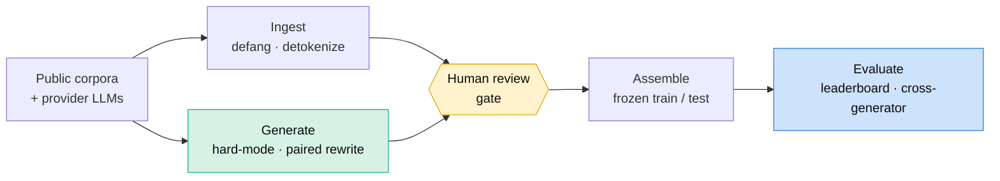

<div align="center">

# 🎣 LureBench

### A benchmark and evaluation harness for detecting AI-generated fraud lures

Phishing, business email compromise, romance and pig-butchering scams, generated by modern LLMs and measured against real human fraud.

[](https://github.com/immu4989/lurebench/actions/workflows/ci.yml)


</div>

---

Fraud detectors that score well on classic spam corpora fall apart on lures written by modern language models. LureBench measures that gap on a common footing: one schema, one harness, one leaderboard, across fraud typologies and generator families. It runs out of the box with no model downloads or API keys, and it ships baseline detectors from a keyword heuristic up to a trained classifier.

More than a corpus, it is a **method for building the corpus honestly**. Getting a credible answer to "can you detect AI-generated fraud?" turned out to require finding, and removing, a dataset confound that makes the problem look far easier than it is. That story is below.

## The finding

Train a classifier to tell AI-written fraud from human-written fraud on a naively assembled corpus, and it looks almost perfect: near-100% recall, a 0.1% false-alarm rate, and it even generalizes to generators it never trained on. That result is a trap.

<p align="center">
  
</p>

Inspecting the model showed it was separating **corpus-of-origin**, not authorship: the human phishing was older, longer, pre-tokenized, and defanged differently than the fresh LLM text. Once the two classes are distribution-matched (each human lure paired with an AI rewrite of the *same* lure, matched on length and defanged the same way), the separation falls apart. Cross-generator recall drops to 32–56%, and the false-alarm rate on human text climbs from 0.1% to a real 10–18%. Distinguishing AI-authored fraud from human-authored fraud, and doing it across generators, is genuinely hard. Full write-up in [docs/provenance_results.md](docs/provenance_results.md).

## Two tasks, and why the distinction matters

A fraud lure raises two separate questions, and most tools answer only one:

- **Is this a fraud lure?** (the `fraud` task, lure vs. benign)
- **Was this written by an LLM?** (the `provenance` task, AI vs. human)

The first is largely a solved classical problem. A trained bag-of-words baseline near-solves it, while a keyword heuristic fails on exactly the AI lures a keyword heuristic should fail on:

<p align="center">
  
</p>

The second question, provenance, is where the real difficulty lives, and where the confound above had to be removed before the number meant anything.

## How it works



Every generated lure is defanged, provenance-logged, and held in a `review: pending` state until a human approves it. Nothing reaches a shard automatically. Train and test are split by a stable hash of each record id, so adding a new generator never reshuffles what was already in the test set.

## What's inside

The `lurebench-core` corpus (20,388 records):

| Class | Count | Detail |
|---|---|---|
| Human phishing + benign | 19,798 | `David-Egea/phishing-texts` (MIT), de-tokenized and defanged |
| AI-generated lures | 590 | across four typologies, three generators |
| — DeepSeek `deepseek-v4-pro` | 190 | |
| — GLM `glm-4.6` | 200 | |
| — Mistral `mistral-large-latest` | 200 | |

Typologies: phishing, BEC, romance, pig-butchering. The AI lures are hard-mode: written to persuade through plausibility and context rather than stock urgency and payment-demand markers.

## Quickstart

```bash
git clone https://github.com/immu4989/lurebench && cd lurebench
pip install -e .

# score the dependency-free heuristic on the sample shard (ships in the repo)
lurebench eval --dataset data/samples/lures.jsonl --detector heuristic-v0
```

The full `lurebench-core` corpus lives on the [Hugging Face Hub](https://huggingface.co/datasets/immu4989/lurebench-core). With its `train.jsonl` / `test.jsonl` in `data/full/core/`, the classical baseline and leaderboard run end to end:

```bash
pip install -e ".[train]"
lurebench train --dataset data/full/core/train.jsonl --out models/tfidf.joblib
lurebench leaderboard --dataset data/full/core/test.jsonl -m heuristic-v0 -m tfidf-logreg
```

Generation uses any OpenAI-compatible provider by name, with your own key:

```bash
export DEEPSEEK_API_KEY=...
lurebench generate --typology bec --n 50 --engine deepseek --hard --out staging/bec.jsonl
```

Eight commands cover the pipeline: `ingest`, `generate`, `assemble-core`, `train`, `eval`, `leaderboard`, `manifest`, `publish`.

## Why it matters

U.S. regulators and law enforcement have named this threat directly. FinCEN's Nov 2024 alert lists GenAI-generated **text** among its red-flag indicators and names BEC, spear phishing, elder exploitation, romance scams and virtual-currency investment ("pig-butchering") scams as active GenAI vectors. The FBI's Dec 2024 IC3 PSA warns that criminals use generative AI to produce fraudulent content at greater scale and believability. FS-ISAC cites a Deloitte projection of $40B in U.S. AI-enabled fraud losses by 2027.

## Responsible use

This is a defensive research project. The corpus exists to train and evaluate detectors. Controlled generation produces defanged, clearly-synthetic, review-gated text. It does not personalize lures to real targets, embed working links or payment rails, or deliver anything. See [DATA.md](DATA.md), [docs/SHARD_SPEC.md](docs/SHARD_SPEC.md) and [CONTRIBUTING.md](CONTRIBUTING.md).

## Honest limitations

LureBench is an early pilot, and the writeups say so plainly:

- The distribution-matched provenance result rests on two generators and phishing only (the human data is phishing-only). DeepSeek's rewrite yield was low, so its numbers are smaller-sample.
- The human corpus is older-era phishing. De-tokenization and rewriting remove the largest tells; the residual signal is register and style, which is arguably legitimate authorship signal, but a contemporary human-fraud source would be stronger.
- Audio and video deepfake fraud are out of scope. They are well served by existing benchmarks (ASVspoof 5, Deepfake-Eval-2024, VishGPT); LureBench covers text.

## Citation

See [CITATION.cff](CITATION.cff). Licensed under Apache-2.0.
