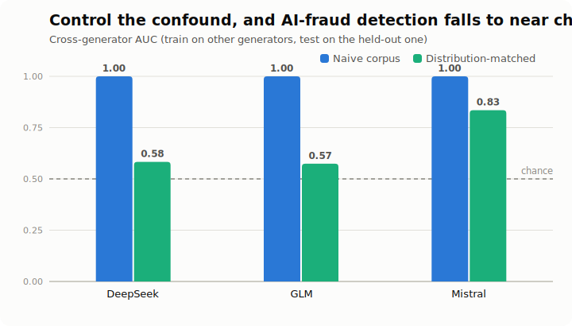
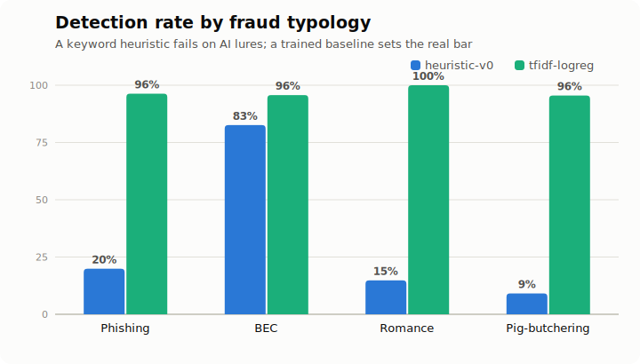
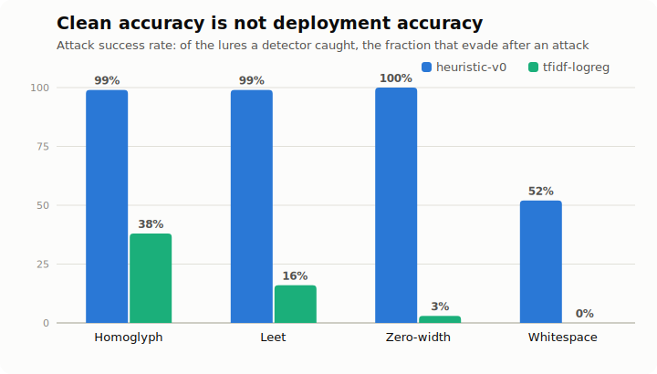
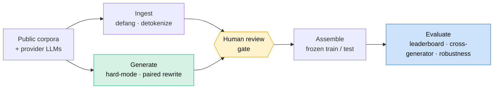

<div align="center">

# 🎣 LureBench

### A benchmark and evaluation harness for detecting AI-generated fraud lures

Phishing, business email compromise, romance and pig-butchering scams, generated by modern LLMs and measured against real human fraud.

[](https://github.com/immu4989/lurebench/actions/workflows/ci.yml)


</div>

---

Fraud detectors that score well on classic spam corpora fall apart on lures written by modern language models. LureBench measures that gap on a common footing: one schema, one harness, one leaderboard, across fraud typologies and generator families. It runs out of the box with no model downloads or API keys, and it ships baseline detectors from a keyword heuristic up to a trained classifier.

More than a corpus, it is a **method for building the corpus honestly**. Getting a credible answer to "can you detect AI-generated fraud?" turned out to require finding, and removing, a dataset confound that makes the problem look far easier than it is. That story is below.

### Who it's for

| You are… | Use LureBench to… |
|---|---|
| **A security engineer / vendor** | Benchmark your fraud detector on a common footing, then stress-test it against attacks a real fraudster would run (`robustness`) before you trust its clean-data score. |
| **A researcher** | Reproduce the provenance confound and its removal, add a detector in ~30 lines ([docs/adding-a-detector.md](docs/adding-a-detector.md)), or extend the corpus with new generators and typologies. |
| **A policy / threat-intel analyst** | Ground claims about "AI-generated fraud detection" in measured numbers — including where it works, and where it is close to a coin flip. |

Everything runs out of the box with no model downloads or API keys; provider keys are only needed to *generate* new lures or run LLM-based attacks, and never touch api.openai.com or api.anthropic.com.

## The finding

Train a classifier to tell AI-written fraud from human-written fraud on a naively assembled corpus, and it looks almost perfect: near-100% recall, a 0.1% false-alarm rate, and it even generalizes to generators it never trained on. That result is a trap.

<p align="center">
  
</p>

Inspecting the model showed it was separating **corpus-of-origin**, not authorship: the human phishing was older, longer, pre-tokenized, and defanged differently than the fresh LLM text. Once the two classes are distribution-matched (each human lure paired with an AI rewrite of the *same* lure, matched on length and defanged the same way), the separation falls apart. Cross-generator AUC drops from a perfect 1.00 to **0.58 and 0.57** for two of the three generators, barely above the 0.50 chance line. Only one model's output (Mistral) keeps a detectable signature at 0.83, and it does not transfer to the others. Distinguishing AI-authored fraud from human-authored fraud, across generators, turns out to be close to a coin flip. Full write-up in [docs/provenance_results.md](docs/provenance_results.md).

## Two tasks, and why the distinction matters

A fraud lure raises two separate questions, and most tools answer only one:

- **Is this a fraud lure?** (the `fraud` task, lure vs. benign)
- **Was this written by an LLM?** (the `provenance` task, AI vs. human)

The first is largely a solved classical problem. A trained bag-of-words baseline near-solves it, while a keyword heuristic fails on exactly the AI lures a keyword heuristic should fail on:

<p align="center">
  
</p>

The second question, provenance, is where the real difficulty lives, and where the confound above had to be removed before the number meant anything.

## Clean accuracy is not deployment accuracy

A detector's score on clean test data is not the number that survives contact with a real fraudster. The adversary does not send the lure your model was trained on: they type `vеrifу` with a Cyrillic `е`, split a trigger word, or paraphrase the whole message. The `robustness` command measures what happens next. It takes the lures a detector **catches**, applies an attack, and reports the **attack success rate** — the fraction that now evade.

<p align="center">
  
</p>

Robustness is a *different axis* from clean accuracy and it ranks detectors differently. The keyword baseline looks cheap and interpretable until an attacker types one homoglyph and 99% of its catches walk through. The trained model degrades gracefully instead of collapsing. That gap — not the clean-data score — is what a buyer needs to see before deploying either. Attacks come in two tiers: free deterministic character tricks (`homoglyph`, `leet`, `zero-width`, `whitespace`) and stronger LLM rewrites (`llm-paraphrase`, `llm-keyword-evasion`, which targets a detector's own most-predictive words). Full write-up in [docs/adversarial-robustness.md](docs/adversarial-robustness.md).

> **Try it interactively** — [**live demo, no install**](https://huggingface.co/spaces/immu4989/lurescope): [**LureScope**](https://github.com/immu4989/lurescope) is the deployable companion — a small API and browser demo where you paste a message, score it, then watch an attack evade the detector live. It reuses these same detectors and attacks.

## How it works



Every generated lure is defanged, provenance-logged, and held in a `review: pending` state until a human approves it. Nothing reaches a shard automatically. Train and test are split by a stable hash of each record id, so adding a new generator never reshuffles what was already in the test set.

## What's inside

The `lurebench-core` corpus (20,388 records):

| Class | Count | Detail |
|---|---|---|
| Human phishing + benign | 19,798 | `David-Egea/phishing-texts` (MIT), de-tokenized and defanged |
| AI-generated lures | 590 | across four typologies, three generators |
| — DeepSeek `deepseek-v4-pro` | 190 | |
| — GLM `glm-4.6` | 200 | |
| — Mistral `mistral-large-latest` | 200 | |

Typologies: phishing, BEC, romance, pig-butchering. The AI lures are hard-mode: written to persuade through plausibility and context rather than stock urgency and payment-demand markers.

## Quickstart

```bash
git clone https://github.com/immu4989/lurebench && cd lurebench
pip install -e .

# score the dependency-free heuristic on the sample shard (ships in the repo)
lurebench eval --dataset data/samples/lures.jsonl --detector heuristic-v0
```

The full `lurebench-core` corpus lives on the [Hugging Face Hub](https://huggingface.co/datasets/immu4989/lurebench-core). Load it in one call, no manual file placement (`v0.2`):

```python
from lurebench import load_core, run
from lurebench.detectors import HeuristicDetector

test = load_core("test")                       # downloads + caches from the Hub
print(run(HeuristicDetector(), test).metrics.mcc)
```

Reproduce the headline finding — the leave-one-generator-out provenance collapse — with one command. Point it at a naive corpus and AUC stays near 1.00 (the confound); point it at the distribution-matched set and it falls to the 0.50 chance line:

```bash
pip install -e ".[train]"
lurebench cross-generator -d data/full/paired/human.jsonl -d data/full/paired/deepseek-v4-pro.jsonl \
  -d data/full/paired/glm-4.6.jsonl -d data/full/paired/mistral-large-latest.jsonl
```

Stress-test a detector the way a real fraudster would — perturb the lures it catches and measure how many now evade (the **attack success rate**). Clean accuracy is not deployment accuracy:

```bash
lurebench robustness -d data/full/core/test.jsonl -m tfidf-logreg \
  -a homoglyph -a leet -a zero-width -a whitespace
```

The keyword baseline looks interpretable until an attacker types `vеrifу` once (ASR 0.99); the trained model degrades gracefully (homoglyph ASR 0.38). See [docs/adversarial-robustness.md](docs/adversarial-robustness.md).

Generation uses any OpenAI-compatible provider by name, with your own key:

```bash
export DEEPSEEK_API_KEY=...
lurebench generate --typology bec --n 50 --engine deepseek --hard --out staging/bec.jsonl
```

Export a dataset (or just the taxonomy) as a **STIX 2.1 bundle** for threat-intel sharing — validated against the official OASIS validator, with curated crosswalks to MITRE ATT&CK, FBI/IC3, and FinCEN:

```bash
lurebench stix -d data/full/core/test.jsonl -o lures.stix.json
lurebench stix --taxonomy-only -o taxonomy.stix.json
```

Eleven commands cover the pipeline: `ingest`, `generate`, `assemble-core`, `train`, `eval`, `leaderboard`, `cross-generator`, `robustness`, `stix`, `manifest`, `publish`. See the [changelog](CHANGELOG.md) for what's new in `v0.4`, the [taxonomy & STIX guide](docs/taxonomy.md), and [docs/adding-a-detector.md](docs/adding-a-detector.md) to contribute a detector.

## Why it matters

U.S. regulators and law enforcement have named this threat directly. FinCEN's Nov 2024 alert lists GenAI-generated **text** among its red-flag indicators and names BEC, spear phishing, elder exploitation, romance scams and virtual-currency investment ("pig-butchering") scams as active GenAI vectors. The FBI's Dec 2024 IC3 PSA warns that criminals use generative AI to produce fraudulent content at greater scale and believability. FS-ISAC cites a Deloitte projection of $40B in U.S. AI-enabled fraud losses by 2027.

LureBench maps its typologies onto exactly those frameworks. The [taxonomy](docs/taxonomy.md) carries curated crosswalks to MITRE ATT&CK, the FBI/IC3 crime categories, and FinCEN advisories, and the `stix` command emits standards-compliant STIX 2.1 — so a detection can travel from a detector to a fusion center, an ISAC, or a SAR narrative without being re-described.

## Responsible use

This is a defensive research project. The corpus exists to train and evaluate detectors. Controlled generation produces defanged, clearly-synthetic, review-gated text. It does not personalize lures to real targets, embed working links or payment rails, or deliver anything. See [DATA.md](DATA.md), [docs/SHARD_SPEC.md](docs/SHARD_SPEC.md) and [CONTRIBUTING.md](CONTRIBUTING.md).

## Honest limitations

LureBench is an early pilot, and the writeups say so plainly:

- The distribution-matched provenance result covers three generators and phishing only (the human data is phishing-only), with a few hundred paired rewrites per generator.
- The human corpus is older-era phishing. De-tokenization and rewriting remove the largest tells; the residual signal is register and style, which is arguably legitimate authorship signal, but a contemporary human-fraud source would be stronger.
- Audio and video deepfake fraud are out of scope. They are well served by existing benchmarks (ASVspoof 5, Deepfake-Eval-2024, VishGPT); LureBench covers text.

## Citation

See [CITATION.cff](CITATION.cff). Licensed under Apache-2.0.
