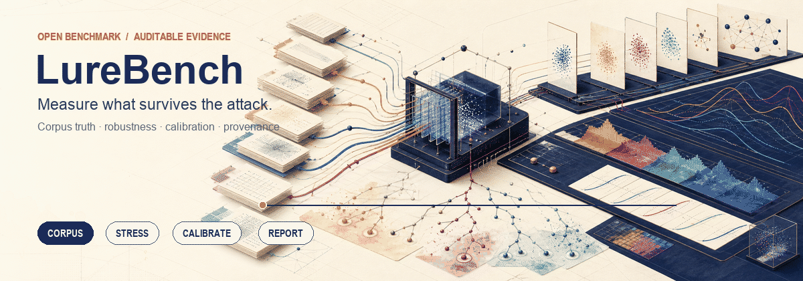
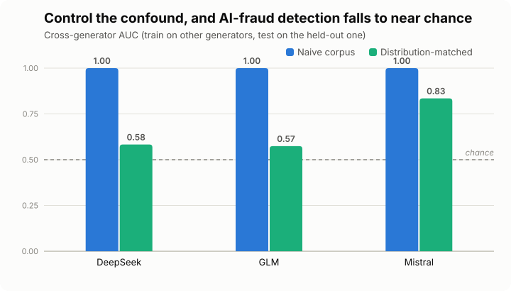
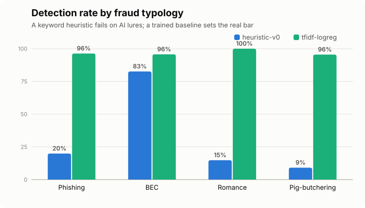
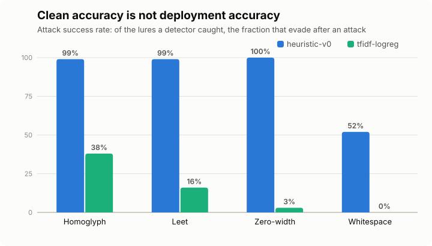
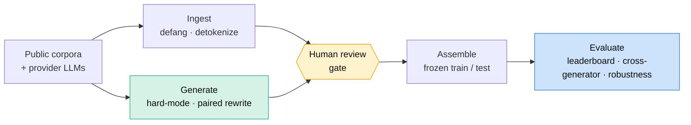

<div align="center">



### The adversarial benchmark for AI-generated fraud

One schema. Three evaluation regimes. Honest answers about what survives deployment.

[](https://github.com/immu4989/lurebench/actions/workflows/ci.yml)
[](https://github.com/immu4989/lurebench/actions/workflows/pypi-smoke.yml)
[](https://pypi.org/project/lurebench/)


[](CODE_OF_CONDUCT.md)
[](SECURITY.md)
[](https://doi.org/10.5281/zenodo.21631777)

</div>

<p align="center">
  <a href="#the-finding"><strong>See the finding</strong></a> ·
  <a href="#quickstart"><strong>Run the benchmark</strong></a> ·
  <a href="docs/LUREINVARIANT.md"><strong>Evaluate system invariants</strong></a> ·
  <a href="https://immu4989.github.io/lurescope/"><strong>Open the LureScope browser lab ↗</strong></a>
</p>

---

Fraud detectors that score well on classic spam corpora fall apart on lures written by modern language models. LureBench measures that gap on a common footing: one schema, one harness, one leaderboard, across fraud typologies and generator families. It runs out of the box with no model downloads or API keys, and it ships baseline detectors from a keyword heuristic up to a trained classifier.

More than a corpus, it is a **method for building the corpus honestly**. Getting a credible answer to "can you detect AI-generated fraud?" turned out to require finding, and removing, a dataset confound that makes the problem look far easier than it is. That story is below.

> **New — test invariants that cross the model, tools, network, identity, and
> lifecycle boundary.** [LureInvariant](docs/LUREINVARIANT.md) evaluates typed
> transitive reachability, required mediation, bounded shutdown, and prohibited
> post-trigger activity from exact plan and observation bytes. Unknown edges and
> incomplete sources fail to `insufficient_evidence`; they never become a quiet
> pass. The before/after reference resolves four violations without weakening
> the invariant contract. No discovery, probe, agent action, or enforcement is
> executed.

> **New — thresholds with evidence, not just point estimates.** LureBench can now
> export a policy only when exact finite-sample tests support a requested
> population false-positive rate. A 1% target at 95% confidence fails closed with
> fewer than 299 benign validation examples even after zero false alarms. See
> [risk-controlled deployment policies](docs/RISK_CONTROL.md).

> **New — evaluate private detectors and private deployments.** The
> [isolated container contract](docs/CONTAINER_DETECTORS.md) benchmarks any
> language or proprietary detector without exposing labels or corpus metadata.
> [LureEval receipts](docs/LUREEVAL.md) carry signed, privacy-minimized aggregate
> operational evidence across organizations. Neither requires messages or
> row-level scores to leave their owner.

> **New — an executable interoperability contract.** The
> [LureEval conformance kit](docs/CONFORMANCE.md) gives any language or vendor 12
> digest-bound accept/reject vectors for strict JSON, privacy boundaries, schema
> enforcement, and metric recomputation. Install `lurebench==0.11.0` and run
> `lurebench conformance` offline; passing tests protocol behavior, not detector
> quality or compliance.

> **New — test the system boundary, not only the model response.**
> [LureBoundary](docs/AGENT_BOUNDARY_ASSURANCE.md) evaluates an autonomous-agent
> monitor on 14 safe, incident-derived trajectories covering transitive egress,
> cross-run signaling, credentials, evaluator awareness, privilege and
> control-plane changes, data staging, and post-stop activity. Ground truth and
> scenario prose are withheld from the monitor; the strict event schema has no
> fields for prompts, commands, payloads, credentials, hosts, URLs, or reasoning.
> `lurebench boundary-eval` reports recall, benign FPR, detection delay, and
> category accuracy. Passing is benchmark evidence—not proof of containment.

> **New — prove what the monitor could observe.** The
> [agent-assurance interoperability suite](docs/AGENT_ASSURANCE_INTEROP.md) adds
> a hardened, language-neutral OCI monitor protocol; LureCoverage canaries for
> telemetry loss, duplication, ordering, latency, and lineage; a 15-scenario
> identity/delegation graph benchmark; and LureIR's five defanged
> incident-response cases. Every contract is strict, metadata-only, and
> independently recomputable. None executes an agent action.

### Who it's for

| You are… | Use LureBench to… |
|---|---|
| **A security engineer / vendor** | Benchmark your fraud detector on a common footing, then stress-test it against attacks a real fraudster would run (`robustness`) before you trust its clean-data score. |
| **A researcher** | Reproduce the provenance confound and its removal, add a detector in ~30 lines ([docs/adding-a-detector.md](docs/adding-a-detector.md)), or extend the corpus with new generators and typologies. |
| **A policy / threat-intel analyst** | Ground claims about "AI-generated fraud detection" in measured numbers — including where it works, and where it is close to a coin flip. |
| **A procurement or assurance team** | Evaluate a proprietary image against a private held-out set, preserve an immutable report, and pool compatible signed field evidence without collecting messages. |
| **An agent platform or frontier AI team** | Measure whether a declared boundary monitor catches typed isolation, identity, lifecycle, and control violations without handling exploit payloads or model reasoning. |

Everything runs out of the box with no model downloads or API keys; provider keys are only needed to *generate* new lures or run LLM-based attacks, and never touch api.openai.com or api.anthropic.com.

## The finding

Train a classifier to tell AI-written fraud from human-written fraud on a naively assembled corpus, and it looks almost perfect: near-100% recall, a 0.1% false-alarm rate, and it even generalizes to generators it never trained on. That result is a trap.

<p align="center">
  
</p>

Inspecting the model showed it was separating **corpus-of-origin**, not authorship: the human phishing was older, longer, pre-tokenized, and defanged differently than the fresh LLM text. Once the two classes are distribution-matched (each human lure paired with an AI rewrite of the *same* lure, matched on length and defanged the same way), the separation falls apart. Cross-generator AUC drops from a perfect 1.00 to **0.58 and 0.57** for two of the three generators, barely above the 0.50 chance line. Only one model's output (Mistral) keeps a detectable signature at 0.83, and it does not transfer to the others. Distinguishing AI-authored fraud from human-authored fraud, across generators, turns out to be close to a coin flip. Full write-up in [docs/provenance_results.md](docs/provenance_results.md).

## Two tasks, and why the distinction matters

A fraud lure raises two separate questions, and most tools answer only one:

- **Is this a fraud lure?** (the `fraud` task, lure vs. benign)
- **Was this written by an LLM?** (the `provenance` task, AI vs. human)

The first is largely a solved classical problem. A trained bag-of-words baseline near-solves it, while a keyword heuristic fails on exactly the AI lures a keyword heuristic should fail on:

<p align="center">
  
</p>

The second question, provenance, is where the real difficulty lives, and where the confound above had to be removed before the number meant anything.

## Clean accuracy is not deployment accuracy

A detector's score on clean test data is not the number that survives contact with a real fraudster. The adversary does not send the lure your model was trained on: they type `vеrifу` with a Cyrillic `е`, split a trigger word, or paraphrase the whole message. The `robustness` command measures what happens next. It takes the lures a detector **catches**, applies an attack, and reports the **attack success rate** — the fraction that now evade.

<p align="center">
  
</p>

Robustness is a *different axis* from clean accuracy and it ranks detectors differently. The keyword baseline looks cheap and interpretable until an attacker types one homoglyph and 99% of its catches walk through. The trained model degrades gracefully instead of collapsing. That gap — not the clean-data score — is what a buyer needs to see before deploying either. Attacks come in two tiers: free deterministic character tricks (`homoglyph`, `leet`, `zero-width`, `whitespace`) and stronger LLM rewrites (`llm-paraphrase`, `llm-keyword-evasion`, which targets a detector's own most-predictive words). Full write-up in [docs/adversarial-robustness.md](docs/adversarial-robustness.md).

> **Try it interactively** — [**live demo, no install**](https://huggingface.co/spaces/immu4989/lurescope): [**LureScope**](https://github.com/immu4989/lurescope) is the deployable companion — a small API and browser demo where you paste a message, score it, then watch an attack evade the detector live. It reuses these same detectors and attacks. Its [robustness scorecard writeup](https://github.com/immu4989/lurescope/blob/main/blog/2026-07-23-robustness-gap-fraud-detection.md) reports detector-by-attack evasion rates over this corpus and shows where a normalization defense recovers the catch (and where it cannot).

## How it works


```mermaid
flowchart LR
    S["Public corpora<br/>+ provider LLMs"] --> ING["Ingest<br/>defang · detokenize"]
    S --> GEN["Generate<br/>hard-mode · paired rewrite"]
    ING --> REV{{"Human review<br/>gate"}}
    GEN --> REV
    REV --> ASM["Assemble<br/>frozen train / test"]
    ASM --> EVAL["Evaluate<br/>leaderboard · cross-generator · robustness"]
    style REV fill:#fff3cd,stroke:#eda100,color:#0b0b0b
    style EVAL fill:#cde2fb,stroke:#2a78d6,color:#0b0b0b
    style GEN fill:#d6f2e6,stroke:#1baf7a,color:#0b0b0b
```

Every generated lure is defanged, provenance-logged, and held in a `review: pending` state until a human approves it. Nothing reaches a shard automatically. Train and test are split by a stable hash of each record id, so adding a new generator never reshuffles what was already in the test set.

## What's inside

The `lurebench-core` corpus (20,388 records):

| Class | Count | Detail |
|---|---|---|
| Human phishing + benign | 19,798 | `David-Egea/phishing-texts` (MIT), de-tokenized and defanged |
| AI-generated lures | 590 | across four typologies, three generators |
| — DeepSeek `deepseek-v4-pro` | 190 | |
| — GLM `glm-4.6` | 200 | |
| — Mistral `mistral-large-latest` | 200 | |

Typologies: phishing, BEC, romance, pig-butchering. The AI lures are hard-mode: written to persuade through plausibility and context rather than stock urgency and payment-demand markers.

## Quickstart

```bash
python -m pip install lurebench
lurebench --help
```

Run the metadata-only agent-boundary benchmark offline:

```bash
lurebench boundary-eval
lurebench boundary-eval --out boundary-evaluation.json --json
```

Evaluate the reference cross-layer invariant remediation. The first command
returns exit `1` because its valid report contains observed violations; the
second returns `0`:

```bash
lurebench invariant-eval \
  --plan examples/lureinvariant/before-plan.json \
  --observations examples/lureinvariant/before-observations.json \
  --out before-evaluation.json
lurebench invariant-eval \
  --plan examples/lureinvariant/after-plan.json \
  --observations examples/lureinvariant/after-observations.json \
  --out after-evaluation.json
```

See the [LureInvariant contract, semantics, and integration
guide](docs/LUREINVARIANT.md). LureScope can independently recompute, sign, and
strictly compare the resulting before/after evidence.

The reviewed reference suite contains 9 violation trajectories and 5 benign
controls. Its deterministic baseline scores 1.00 recall, 0.00 benign FPR, 1.00
category accuracy, and zero-event delay; that result validates the harness, not
a production deployment. See the [protocol and claims boundary](docs/AGENT_BOUNDARY_ASSURANCE.md).

Evaluate a proprietary monitor image, then measure sensor coverage and the
delegation/incident-response layers:

```bash
lurebench boundary-eval \
  --image vendor-monitor@sha256:<digest> \
  --out boundary-evaluation.json \
  --container-report boundary-container-evidence.json

lurebench coverage-canaries \
  --manifest examples/lurecoverage/manifest.json \
  --replicates 3 --out coverage-canaries.json
lurebench coverage-eval \
  --manifest examples/lurecoverage/manifest.json \
  --canaries coverage-canaries.json \
  --observations sensor-observations.json \
  --out coverage-evaluation.json

lurebench delegation-eval --out delegation-evaluation.json
lurebench ir-tasks --out lureir-tasks.json
lurebench ir-eval --responses responder-submission.json \
  --responder-id local-team --responder-version 1.0.0 \
  --out lureir-evaluation.json
```

The full protocol, response shapes, metrics, safety boundary, and reference OCI
image are documented in
[Agent assurance interoperability](docs/AGENT_ASSURANCE_INTEROP.md).

Clone the repository when you want the bundled sample data, research artifacts,
and reproducibility commands:

```bash
git clone https://github.com/immu4989/lurebench && cd lurebench
python -m pip install -e .

# score the dependency-free heuristic on the sample shard (ships in the repo)
lurebench eval --dataset data/samples/lures.jsonl --detector heuristic-v0
```

The full `lurebench-core` corpus lives on the [Hugging Face Hub](https://huggingface.co/datasets/immu4989/lurebench-core). Load it in one call, no manual file placement (`v0.2`):

```python
from lurebench import load_core, run
from lurebench.detectors import HeuristicDetector

test = load_core("test")                       # downloads + caches from the Hub
print(run(HeuristicDetector(), test).metrics.mcc)
```

Reproduce the headline finding — the leave-one-generator-out provenance collapse — with one command. Point it at a naive corpus and AUC stays near 1.00 (the confound); point it at the distribution-matched set and it falls to the 0.50 chance line:

```bash
python -m pip install -e ".[train]"
lurebench cross-generator -d data/full/paired/human.jsonl -d data/full/paired/deepseek-v4-pro.jsonl \
  -d data/full/paired/glm-4.6.jsonl -d data/full/paired/mistral-large-latest.jsonl
```

Stress-test a detector the way a real fraudster would — perturb the lures it catches and measure how many now evade (the **attack success rate**). Clean accuracy is not deployment accuracy:

```bash
lurebench robustness -d data/full/core/test.jsonl -m tfidf-logreg \
  -a homoglyph -a leet -a zero-width -a whitespace
```

The keyword baseline looks interpretable until an attacker types `vеrifу` once (ASR 0.99); the trained model degrades gracefully (homoglyph ASR 0.38). See [docs/adversarial-robustness.md](docs/adversarial-robustness.md).

Generation uses any OpenAI-compatible provider by name, with your own key:

```bash
export DEEPSEEK_API_KEY=...
lurebench generate --typology bec --n 50 --engine deepseek --hard --out staging/bec.jsonl
```

Export a dataset (or just the taxonomy) as a **STIX 2.1 bundle** for threat-intel sharing — validated against the official OASIS validator, with curated crosswalks to MITRE ATT&CK, FBI/IC3, and FinCEN:

```bash
lurebench stix -d data/full/core/test.jsonl -o lures.stix.json
lurebench stix --taxonomy-only -o taxonomy.stix.json
```

Benchmark a proprietary or non-Python detector through a hardened local OCI
boundary. Only text, declared language/channel, task, and an opaque sequential
request ID enter the container—never labels, source, typology, generator, corpus
IDs, or metadata:

```bash
lurebench container-eval \
  --dataset private-heldout.jsonl \
  --image vendor-detector@sha256:<digest> \
  --out immutable-evaluation.json
```

The image is never pulled implicitly and runs with no network, host mounts,
capabilities, privileges, or writable root. See the
[protocol, threat boundary, reference image, and non-guarantees](docs/CONTAINER_DETECTORS.md).

Build a leakage-resistant v2 release candidate by clustering declared families
and near duplicates *before* deterministic stratification. Held-out labels must
be written separately from the public directory:

```bash
lurebench assemble-core-v2 \
  -s approved-a.jsonl -s approved-b.jsonl \
  -o release-candidate/public \
  --heldout-out private-evaluator/core-v2-heldout.jsonl
```

This is release infrastructure, not a claim that a corrected v2 corpus has
already been collected or published. See [benchmark validity](docs/VALIDITY.md).

Measure the **cross-lingual gap** — how detectors hold up when the language shifts. Across eight languages the trained baseline posts a near-perfect ~1.00 recall, which looks like flawless multilingual detection; strip the defang placeholder and it splits along script lines — Latin-script survives, but every non-Latin script collapses (Chinese 1.00→0.09, Russian 0.94→0.06, Arabic 0.98→0.04), exposing the recall as a `<<link>>` artifact rather than detection (see [docs/multilingual.md](docs/multilingual.md)):

```bash
lurebench multilingual -d data/full/multilingual/eval.jsonl -m tfidf-logreg -m heuristic-v0
```

The fix for that gap is a detector that reads meaning, not tokens: **`llm-judge`** asks an LLM over the same provider plumbing as generation (your key, never OpenAI/Anthropic) and is the strongest detector you can run without a GPU or OpenAI credits. It closes the cross-lingual gap (non-Latin artifact-controlled recall ~0.06 → ~0.94) and shrugs off the character attacks that break the baselines (homoglyph attack-success 1.00 → 0.08), with a semantic paraphrase its one real weakness. Full write-up and honest limits in [docs/llm-detector.md](docs/llm-detector.md):

```bash
export DEEPSEEK_API_KEY=...   # or MISTRAL_API_KEY / ZHIPUAI_API_KEY
lurebench eval -d data/full/core/test.jsonl -m llm-judge
```

### Six models, four questions

With an aggregator key (`openrouter`) one run scores a whole panel, so the LLM rows are no longer a single provider's word. Measured across `gpt-5-nano`, `gemini-2.5-flash-lite`, `deepseek-v4-flash`, `qwen-2.5-7b`, `llama-3.1-8b` and `mistral-nemo`:

- **[Leaderboard](docs/leaderboard.md)** — every judge lands below the trained baseline on clean data (AUC 0.82–0.94 against tfidf's 0.99), and the `scored` column shows how many records each was willing to answer.
- **[Multilingual](docs/multilingual_llm.md)** — the practical win. Artifact-controlled, `deepseek-v4-flash` reads Arabic 0.93 / Russian 0.78 / Chinese 0.75 at a **1% false-positive rate**, where the trained baseline collapses to 0.04 / 0.06 / 0.09. Every row carries an FPR, because on an all-fraud shard a detector that flags everything scores a perfect 1.00 in nine languages.
- **[Provenance](docs/provenance_llm.md)** — the null result. Asked to tell AI-written fraud from human-written fraud on distribution-matched data, four of six models sit at or below chance (AUC 0.46–0.53), and three simply answer "AI" every time. The confound finding above is not something a bigger model reads its way out of.
- **[Adaptive robustness](docs/adaptive_robustness.md)** — the inversion. Let the attacker rewrite up to five times instead of once and the ordering flips: the trained baseline holds at 9% evasion while the judges reach 35–40%. Character attacks break token models and semantic attacks break LLM judges, which is an argument for running both. Rates are the mean of three replicates with the range reported, because a single run of this experiment moves by up to 17 points — hosted providers are not deterministic even at temperature 0.

```bash
export OPENROUTER_API_KEY=...
lurebench leaderboard -d data/full/core/test.jsonl \
  -m tfidf-logreg -m 'llm-judge@openrouter/deepseek/deepseek-v4-flash' \
  --cache-dir .cache/lb --workers 12
```

The CLI covers the pipeline, including `audit-splits` for cross-split
near-duplicate detection and `calibrate` for validation-only policy export.
`assemble-core-v2` produces clustered train/validation/test plus a separately
held private split, and `eval
--bootstrap 2000` adds uncertainty intervals. See [benchmark validity](docs/VALIDITY.md),
the [finite-sample FPR control method](docs/RISK_CONTROL.md),
the [changelog](CHANGELOG.md), the [taxonomy & STIX guide](docs/taxonomy.md), and
[docs/adding-a-detector.md](docs/adding-a-detector.md) to contribute a detector.

## Why it matters

U.S. regulators and law enforcement have named this threat directly. FinCEN's Nov 2024 alert lists GenAI-generated **text** among its red-flag indicators and names BEC, spear phishing, elder exploitation, romance scams and virtual-currency investment ("pig-butchering") scams as active GenAI vectors. The FBI's Dec 2024 IC3 PSA warns that criminals use generative AI to produce fraudulent content at greater scale and believability. FS-ISAC cites a Deloitte projection of $40B in U.S. AI-enabled fraud losses by 2027.

LureBench maps its typologies onto exactly those frameworks. The [taxonomy](docs/taxonomy.md) carries curated crosswalks to MITRE ATT&CK, the FBI/IC3 crime categories, and FinCEN advisories, and the `stix` command emits standards-compliant STIX 2.1 — so a detection can travel from a detector to a fusion center, an ISAC, or a SAR narrative without being re-described.

## Responsible use

This is a defensive research project. The corpus exists to train and evaluate detectors. Controlled generation produces defanged, clearly-synthetic, review-gated text. It does not personalize lures to real targets, embed working links or payment rails, or deliver anything. See [DATA.md](DATA.md), [docs/SHARD_SPEC.md](docs/SHARD_SPEC.md) and [CONTRIBUTING.md](CONTRIBUTING.md).

## Honest limitations

LureBench is an early pilot, and the writeups say so plainly:

- The distribution-matched provenance result covers three generators and phishing only (the human data is phishing-only), with a few hundred paired rewrites per generator.
- The human corpus is older-era phishing. De-tokenization and rewriting remove the largest tells; the residual signal is register and style, which is arguably legitimate authorship signal, but a contemporary human-fraud source would be stronger.
- Audio and video deepfake fraud are out of scope. They are well served by existing benchmarks (ASVspoof 5, Deepfake-Eval-2024, VishGPT); LureBench covers text.

## Contributing

Detectors, data shards, attacks, and corrections to published numbers are all
welcome. Start with [CONTRIBUTING.md](CONTRIBUTING.md) and
[docs/adding-a-detector.md](docs/adding-a-detector.md); a detector is about thirty
lines. Community expectations are in [CODE_OF_CONDUCT.md](CODE_OF_CONDUCT.md).

[SECURITY.md](SECURITY.md) covers both conventional vulnerabilities and what is
*not* one here: the corpus containing fraud lures, the attacks succeeding, and
detectors scoring badly are all intended. It also describes how to report a
measurement error, which for a benchmark matters as much as a memory-safety bug.

Release history is in [CHANGELOG.md](CHANGELOG.md).

## Citation

See [CITATION.cff](CITATION.cff). Archived releases carry a DOI: cite the concept DOI [10.5281/zenodo.21631777](https://doi.org/10.5281/zenodo.21631777), which always resolves to the latest version. Licensed under Apache-2.0.

[paper.md](paper.md) is an unsubmitted draft of a software paper, kept in the repo
so the framing evolves with the code. It has not been peer reviewed and should not
be cited as a publication.
