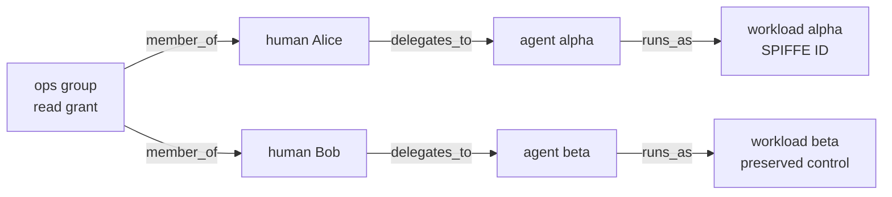

# LureIdentity: identity-lifecycle authorization closure

Disabling a user record is not the same as removing every authority that reached
an AI agent through that user. A group grant can flow through a human, a delegated
agent, and a running workload; distributed policy nodes can then apply the
lifecycle change at different times. LureIdentity turns that closure problem into
a deterministic, independently recomputable benchmark.

It uses typed synthetic metadata only. It does not authenticate an identity,
send a SCIM request, invoke a policy engine, contact a workload, or execute an
access attempt.

## What the benchmark proves within its declared boundary

For each lifecycle event, LureIdentity independently recomputes:

1. every baseline authorization reachable through the declared authority graph;
2. the graph after applying exactly that event;
3. the complete set difference—the authorization cut;
4. whether every preregistered cut actor loses all baseline authorization;
5. whether every preregistered control actor retains all baseline authorization;
6. event delivery and convergence at every declared enforcement node; and
7. the expected decision and reason for every access probe.

An alternate grant or authority edge that keeps a required actor authorized
invalidates the plan. A plan also fails validation if its declared cut actors do
not exactly cover all actors affected by the event, if a preserved actor sits in
the event's dependency cone, or if any required pre-event, post-deadline, or
preservation probe is missing.

## Compile a real campaign without hand-authoring closure

Start from the strict, runnable
[`examples/lureidentity-campaign-v1.json`](../examples/lureidentity-campaign-v1.json)
contract. Replace its synthetic graph, projected events, topology, schedule, and
acceptance thresholds with reviewed opaque metadata, then compile it:

```bash
lurebench identity-compose \
  --campaign examples/lureidentity-campaign-v1.json \
  --out identity-plan.json
```

The campaign deliberately contains no event sequence, event digest, cut-actor
list, preserved-actor list, or probes. The compiler derives these fields. For
each event it independently computes the before/after authorization sets,
requires every affected actor to lose all baseline authority, selects every
unchanged baseline-authorized actor outside the dependency cone as a collateral
control, and generates pre-event, propagation-window, and post-deadline cut
probes plus post-deadline preservation probes at every node. Stable ordinal
probe IDs do not expose actor names.

Composition fails before output if event times are not strictly increasing, a
target is type-incompatible, an alternate authority path leaves a cut actor
partially authorized, no independent preservation control exists, a phase falls
outside the 24-hour relative clock, or the derived matrix exceeds 8,192 probes.
The compiler then submits its output to the normal plan validator; composition
is not an alternate or weaker validation path.

The versioned
[`conformance/lureidentity-campaign-v1`](../conformance/lureidentity-campaign-v1/)
vector publishes one campaign and its exact expected plan. LureScope consumes
the same files with a separate implementation that imports no LureBench code:

```bash
lurescope identity verify-campaign \
  conformance/lureidentity-campaign-v1/campaign.json \
  conformance/lureidentity-campaign-v1/plan.json \
  --out identity-campaign-verification.json
```

The verification report is self-contained and recomputable. LureScope's
deployment gate requires it, so a manually under-specified plan cannot replace
the compiled contract without changing the bound plan digest.

The campaign is a declaration, not topology discovery. Review it and run the
separate runtime topology audit before collecting evidence. A source-event
digest is a caller-supplied commitment and does not authenticate the event.

## Authority model

Edges point in the direction authority flows:



The graph must be acyclic and relationship types constrain endpoint kinds:

| Relationship | Source | Target |
|---|---|---|
| `member_of` | group | human |
| `delegates_to` | human or agent | agent |
| `runs_as` | agent | workload |

A grant applies to its principal and every active descendant reachable through
active edges. Each event is applied to the same baseline, not cumulatively, so
one earlier event cannot hide a later event's failure.

## Lifecycle cases

| Event | Graph operation | Reference cut |
|---|---|---:|
| `scim_user_deactivated` | set the human principal inactive | human, agent, workload: 3 authorizations |
| `scim_group_membership_removed` | remove the group → human edge | human, agent, workload: 3 authorizations |
| `delegation_revoked` | remove the human/agent → agent edge | agent, workload: 2 authorizations |
| `workload_retired` | set the workload principal inactive | workload: 1 authorization |

The first two are intentionally narrow projections of the SCIM core attributes
`User.active` and `Group.members` defined by [RFC 7643](https://www.rfc-editor.org/rfc/rfc7643.html).
LureIdentity does not implement the SCIM HTTP protocol, PATCH semantics,
provisioning server, authentication, or authorization described by
[RFC 7644](https://www.rfc-editor.org/rfc/rfc7644.html). A production bridge must
perform those duties before emitting the normalized metadata accepted here.
`lurebench.identity_adapters.project_verified_scim_change` provides that narrow
boundary: it accepts only an exact `lureidentity-scim-change-v1` object whose
four external verification assertions are true, checks issuer and tenant against
the plan, supports only user deactivation and group-member removal, resolves a
removal to exactly one authority edge, and binds a caller-supplied source-event
SHA-256 digest. The booleans and digest are claims supplied by the caller; the
adapter does not make them true or retain the source bytes.

Workload principals carry canonical SPIFFE IDs. The benchmark validates the
stable specification's bounded trust-domain and path grammar, rejects ambiguous
URI components, and requires a non-root workload path. See the exact
[SPIFFE ID validation boundary](SPIFFE_ID_VALIDATION.md). A production
integration must still authenticate an SVID and obtain the identity through a
trusted Workload API; see the [SPIFFE specifications](https://spiffe.io/docs/latest/spiffe-specs/).
The separate topology audit additionally checks whether each declared workload
trust domain appears in the exact runtime profile allowlist. Allowlist membership
does not authenticate an SVID or prove that the workload possessed it.

## Run the reference workflow

```bash
lurebench identity-export --out identity-plan.json
lurebench identity-run \
  --plan identity-plan.json \
  --out identity-run.json
lurebench identity-eval \
  --plan identity-plan.json \
  --run identity-run.json \
  --out identity-evaluation.json
lurebench identity-topology-audit \
  --plan identity-plan.json \
  --out identity-topology-audit.json
```

The reference run has seven principals, six authority edges, one group grant,
four lifecycle events, nine policy nodes, nine event-specific authorization
cuts, 36 required deliveries, and 279 access probes. Event delivery converges in
at most 450 ms under a 500 ms threshold. Its topology audit covers all nine
reference LurePermit Runtime mediation points and both workload trust domains.
The run also includes a bad event digest and a duplicate event at each event's
first node.

Outputs are canonical JSON, mode `0600` on POSIX, and never overwrite an
existing path. Exit `0` means the evaluation passed its preregistered thresholds,
exit `1` is a valid failing evaluation, and exit `2` is invalid input or I/O.

## Integrate a real system

1. Export the reference plan and replace the synthetic principals, edges,
   grants, nodes, lifecycle events, and thresholds with reviewed opaque metadata,
   or preferably fill the campaign contract and run `identity-compose` so cut
   sets, controls, event digests, and probes are derived rather than transcribed.
   Export or load the reviewed LurePermit Runtime profile for the same system,
   run `identity-topology-audit`, and require a passing result before collection.
   The audit compares declarations; it does not discover hidden paths.
2. Keep prompts, commands, token values, credentials, target locations, SCIM
   payloads, and personal data outside the artifact.
3. Authenticate and authorize directory operations in the production SCIM
   service. Normalize only the event type, opaque target, relative time, and
   commitment required by the plan. Pass that metadata through
   `project_verified_scim_change`; never pass a raw SCIM payload.
4. Obtain workload identity from an authenticated mechanism such as a verified
   SPIFFE SVID—not from an agent-supplied string.
5. Deliver each event to every declared policy node. Record receipt time,
   digest, and the node's disposition (`applied`, `duplicate`, or `invalid`).
6. Run every preregistered probe through the real enforcement point and record
   only `allow`/`block` plus the bounded reason code. Do not use
   `reference_identity_run` as evidence about a production system.
7. Prefer the strict [body-free OpenTelemetry bridge](LUREIDENTITY_OPENTELEMETRY.md)
   for production-like collection. It rejects log bodies and unknown
   attributes, binds collector metadata without scoring it, checks each access
   timestamp against its preregistered probe, and canonicalizes observations in
   plan order so exporter order cannot change the run.
8. Evaluate the externally produced run. Treat missing delivery, a stale
   post-deadline allow, an unexplained denial of a preserved control, an
   incorrect reason, or incomplete signal handling as a failure.
9. Independently recompile the campaign with LureScope's `verify-campaign`
   command and retain its verification report for the deployment gate.
10. Protect and sign the resulting evaluation with LureScope's independent
   `identity create`/`verify` workflow. LureScope separately recomputes the graph
   and metrics without importing LureBench, then can emit P-256 DSSE, OSCAL, and
   SARIF evidence. A digest or signature still does not establish identity or
   observation authenticity.

The February 2026 [NIST NCCoE agent identity and authorization concept
paper](https://www.nccoe.nist.gov/publications/other/accelerating-adoption-software-and-ai-agent-identity-and-authorization-concept)
motivates agent identity, authorization, delegation, human binding, and audit as
an interoperable systems problem. It is a draft concept paper, not a standard,
and this project makes no NIST conformance or endorsement claim. The graph is
also not an NGAC implementation or conformance test.

## Metrics

| Metric | What it detects |
|---|---|
| affected authorization count | independently derived event-specific closure surface |
| delivery coverage | event/node pairs with one valid applied observation |
| p95 and maximum convergence | delay from event occurrence to first valid application |
| deadline misses | nodes with no valid application within the threshold |
| cut recall | required blocks that the submitted run actually blocked |
| post-deadline stale allows | authority that remained usable after closure was required |
| preserved allow rate | unrelated preregistered access that stayed available |
| collateral blocks | preserved controls incorrectly denied |
| pre-event allow rate | premature removals before the lifecycle event |
| disposition accuracy | independently derived invalid/applied/duplicate handling |

Decision and reason correctness are mandatory even if aggregate thresholds would
otherwise pass. A report embeds its exact plan and run, binds both with SHA-256,
and is accepted only if every field independently recomputes.

## Claims boundary

A pass means only that the submitted metadata is internally consistent and meets
the embedded thresholds for the declared graph, events, nodes, and probes. It
does not prove that:

- the human, agent, workload, directory, event, or sensor was authentic;
- every real grant or enforcement path was declared;
- the runtime profile discovered every real mediation point or trust domain;
- a SCIM request was valid, authorized, delivered, or applied;
- clocks were synchronized or observations were complete and independent;
- a policy engine or downstream service actually enforced the decision; or
- the system satisfies NIST guidance, zero trust, FedRAMP, FISMA, CMMC, SOC 2,
  ISO 27001, or another legal, regulatory, or assurance requirement.

These exclusions are part of the public schemas and cannot be removed while
retaining a valid LureIdentity artifact.
