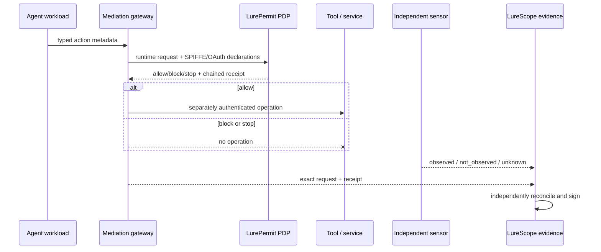

# Runtime authorization and mediation assurance for AI agents

LurePermit Runtime turns the offline permit contract into a side-effect-free
policy decision point (PDP), hash-chained decision receipts, independent sensor
reconciliation, and stateful adversarial trajectories. It is designed for teams
that need to test and integrate agent authorization without placing prompts,
commands, payloads, target locations, credentials, tokens, or model reasoning in
the evidence plane.

This is a research-pilot control and evidence contract. It is not a credential,
policy-enforcement proxy, compliance result, or claim that every action was
mediated.

## Why this exists

Recent primary guidance converges on a system-level problem:

- The February 2026 [NIST NCCoE Software and AI Agent Identity and Authorization
  concept paper](https://www.nccoe.nist.gov/publications/other/accelerating-adoption-software-and-ai-agent-identity-and-authorization-concept)
  frames agent identity, authentication, authorization, delegation, human
  binding, audit, and non-repudiation across workforce-assistant, security-agent,
  and software-deployment use cases. It is a concept paper, not a final standard.
- [NIST SP 800-207A](https://doi.org/10.6028/NIST.SP.800-207A) describes
  identity-tier policy enforcement using API gateways, sidecars, service meshes,
  and workload identity such as SPIFFE.
- The [MCP authorization specification](https://modelcontextprotocol.io/specification/2025-06-18/basic/authorization)
  requires resource indicators and audience validation and prohibits forwarding
  a client token unchanged to an upstream service.
- OpenAI's August 2026 [Hugging Face incident report and response](https://openai.com/index/hugging-face-incident-and-the-road-ahead/)
  identifies the need for stronger workload/network isolation, continuous
  security testing, safe stopping on broken or impossible tasks, multi-agent and
  long-task alignment, and clearer tiered incident response.

LurePermit Runtime converts those themes into bounded, testable metadata
contracts. It does not claim endorsement by any cited organization.

## Architecture



Only the gateway is positioned to enforce. The PDP evaluates typed metadata and
never calls `T`. The sensor is independent evidence input; declaring a sensor ID
does not authenticate the sensor or prove coverage.

## What is implemented

| Control | Runtime behavior |
|---|---|
| Workload identity | Spec-bounded canonical SPIFFE ID and explicit trust-domain allowlist |
| Human authority | High-impact actions bind an operator, approval ID, and exact request digest |
| Delegation and peers | Bounded depth; revoked or unauthorized peers safe-stop |
| OAuth/OIDC metadata | MCP resource and audience binding; agent actor binding; no token values |
| Token isolation | Token passthrough safe-stops; upstream services require a separate exchanged token |
| Policy freshness | Revoked/expired permits and stale policy generations safe-stop |
| Long tasks | Impossible/corrupted task states safe-stop; stopped runs remain stopped |
| Replay | Nonces and monotonic run sequence are statefully rejected |
| Audit integrity | Receipts bind the exact request and form a SHA-256 predecessor chain |
| Policy correctness | Receipt decisions and reasons are independently derived from stateful profile/permit semantics |
| Enforcement evidence | Registered sensors distinguish effective, bypassed, unmediated, unknown, and incomplete effects |
| Coverage | Request coverage and distinct mediation-point coverage are measured separately |

## Five-minute local evaluation

```bash
lurebench runtime-init --out runtime-profile.json
lurebench runtime-trace --out runtime-trace.json
lurebench runtime-eval \
  --trace runtime-trace.json \
  --out runtime-evaluation.json
lurebench stateful-range-export --out stateful-suite.json
lurebench stateful-range-eval \
  --suite stateful-suite.json \
  --out stateful-evaluation.json
```

The reference runtime trace has 11 typed requests across all nine registered
mediation points. The stateful range contains 15 trajectories and 22 steps for
safe stopping, unauthorized peers, shared-state signaling, transitive package
egress, credential reuse, token passthrough, wrong audience, approval rebinding,
permit revocation, policy rollback, excessive delegation, sensor suppression,
replay, and evaluator tampering.

Outputs are canonical JSON, mode `0600` on POSIX, and never overwrite an
existing path. Exit `0` is a pass, `1` is a valid failing evaluation, and `2` is
invalid input or an I/O failure.

## Run the decision service

```bash
lurebench permit-serve \
  --host 127.0.0.1 \
  --port 8765 \
  --receipt-log receipts.jsonl
```

For a local shared socket:

```bash
lurebench permit-serve \
  --unix-socket /run/lurepermit/decision.sock \
  --receipt-log receipts.jsonl
```

The service refuses non-loopback IPs, caps request bodies at 64 KiB, accepts
strict JSON only, does not overwrite its receipt log, writes it mode `0600`, and
uses `fsync` after each receipt. `/openapi.json` and the packaged
[`lurepermit-runtime-openapi-v1.json`](../spec/lurepermit-runtime-openapi-v1.json)
describe the API. Socket/file permissions are local access controls; production
deployments still need OS/container isolation and authenticated workload identity.

## Integrate an enforcement point

1. Authenticate the caller outside LureBench. Obtain the SPIFFE ID from a
   verified workload certificate, not a request body.
2. Validate OAuth/OIDC issuer, signature, expiry, audience, subject, and actor.
   Never pass the raw token to LurePermit or its logs.
3. Convert the intended operation to `build_permit_request`, then wrap it with
   `build_runtime_request`. The representation must contain metadata only.
4. Send it to `RuntimePDP.decide` or local `/v1/decide` before executing the
   operation.
5. Fail closed on transport errors, malformed decisions, mismatched request IDs,
   sequence numbers, or digests.
6. Execute an allowed operation in a separately secured component. The decision
   is not the operation.
7. Record independently produced sensor observations for the registered
   mediation point. Preserve `unknown`; never translate it to success.

SPIFFE parsing is shared with LureIdentity and enforces the stable
specification's 2,048-byte ID, 255-byte trust-domain, forbidden URI-component,
and path-segment rules. Workload IDs require a non-root path. See the
[validation and authentication boundary](SPIFFE_ID_VALIDATION.md).
8. Build a trace and run `runtime-eval`. Sign the resulting independent evidence
   with LureScope.

The adapters in `lurebench.runtime_adapters` translate to or from MCP, OPA,
Cedar, Envoy ext_authz-style attributes, and SPIFFE declarations without making
network calls. They do not validate certificates/tokens and do not run the
external policy engine. See [`examples/runtime`](../examples/runtime/README.md).

Before claiming that revocation reaches this runtime surface, use
`lurebench revocation-topology-audit` to reconcile a LureRevoke plan with every
declared mediation point in this profile. Missing or unknown mappings fail; the
audit does not perform service discovery or prove deployment topology.

## Reconciliation semantics

| Receipt | Sensor effect | Classification | Meaning within submitted evidence |
|---|---|---|---|
| allow | observed | `effective` | allowed effect was observed |
| allow | not observed | `incomplete_effect` | receipt exists but effect was not observed |
| block/stop | not observed | `effective` | denied effect was not observed |
| block/stop | observed | `control_bypass` | denied effect was observed |
| missing | observed | `unmediated` | effect exists without a bound decision receipt |
| any/missing | missing, mixed, or unknown required sensors | `unknown` | evidence cannot determine effect |

`effective` is intentionally narrow. It does not prove the sensor was truthful,
that no alternate path existed, or that every operation was submitted. It also
does not override policy correctness: decision and reason accuracy are separate
mandatory acceptance gates.

## NIST concept-paper implementation mapping

The machine-readable demonstration mapping is
[`docs/nist/agent-identity-demonstration.yaml`](nist/agent-identity-demonstration.yaml).
It records implemented, adapter-only, and external responsibilities separately.
Highlights:

| Capability | Status |
|---|---|
| Unique agent/workload identity binding | Implemented metadata contract; external authentication required |
| Human-on-behalf-of binding | Implemented for declared high-impact actions |
| Delegation constraints | Implemented and statefully evaluated |
| MCP/OAuth audience and token-exchange boundary | Implemented metadata decision; external token validation/exchange required |
| SPIFFE | Canonical ID/trust-domain validation; Workload API verification external |
| OPA, Cedar, Envoy | Offline translators and strict response bindings; deployment external |
| SCIM | RFC 7643 lifecycle metadata projection and LureIdentity closure benchmark; protocol/authentication external |
| NGAC | Not implemented; LureIdentity graph semantics are not an NGAC conformance claim |
| Audit/non-repudiation | Chained receipts; organizational non-repudiation requires signed LureScope evidence and key governance |

## Claims and safety boundary

A pass means the submitted request, receipt, and sensor metadata reconcile under
the embedded profile and acceptance thresholds. It does not establish that every
agent action traversed a gateway, that identities or sensors were authentic, that
an infrastructure was contained, or that a system satisfies NIST, FedRAMP,
FISMA, CMMC, SOC 2, ISO 27001, or another requirement. OSCAL export from
LureScope is observation-only and deliberately contains no findings.
