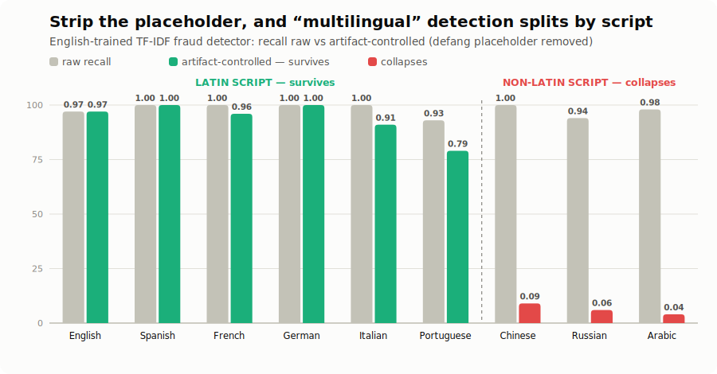

# Multilingual fraud detection — and why the recall you see is a mirage

Fraud detectors are trained almost entirely on English. Fraud is not. The same lure is
sent in Spanish, Portuguese, Chinese, and dozens of other languages, and the populations
some scams target most are not English-first. So the obvious question is: how do
English-trained detectors do when the language shifts?

The answer turned out to be more interesting than "they fail" — and checking it carefully
is the whole point.

<p align="center">
  
</p>

## The pilot set

Controlled-generation data: hard-mode AI lures produced in each language by a provider
that handles it well (Mistral for the European languages, DeepSeek for the non-Latin
scripts), under the same defensive guardrails as the rest of LureBench (placeholders only,
no real entities). It covers `phishing` and `bec` across **eight languages** — Spanish,
French, German, Italian, Portuguese (Latin script) and Chinese, Russian, Arabic (non-Latin
script) — **255 non-English lures**, 22–56 per language, evaluated against the **38 English
AI lures already in `lurebench-core`** as the baseline. The effect is categorical, and it
splits cleanly along script lines.

## What a naive evaluation shows

Run the two baselines and look at raw recall (fraction of lures flagged):

| Detector | English | Spanish | French | German | Italian | Portuguese | Chinese | Russian | Arabic |
|---|---|---|---|---|---|---|---|---|---|
| `tfidf-logreg` (trained) | 0.97 | 1.00 | 1.00 | 1.00 | 1.00 | 0.93 | 1.00 | 0.94 | 0.98 |
| `heuristic-v0` (keyword) | 0.68 | 0.00 | 0.07 | 0.27 | 0.09 | 0.68 | 0.00 | 0.00 | 0.00 |

Two different stories. The keyword detector collapses the moment the language changes —
unsurprising, it keys on English words. But the **trained model looks *perfectly*
cross-lingual**: ~1.00 recall in every language, including Chinese, Russian, and Arabic. If
you stopped here, you would ship a press release saying LureBench's trained baseline
detects fraud in any language.

That would be wrong.

## What an honest evaluation shows

Every generated lure is defanged: a URL becomes `<<link>>`, which tokenizes to the word
`link` — one of the model's strongest fraud features, present in **every** language. So
"detection" might just be the model spotting that a URL was there, not reading the lure.
The `multilingual` command tests this directly by re-scoring with the placeholders
stripped (the artifact-controlled column is shown by default):

| Language | Script | Lures | `tfidf-logreg` raw → controlled | `heuristic-v0` raw → controlled |
|---|---|---|---|---|
| English | Latin | 38 | 0.97 → **0.97** | 0.68 → 0.08 |
| Spanish | Latin | 32 | 1.00 → **1.00** | 0.00 → 0.00 |
| French | Latin | 27 | 1.00 → **0.96** | 0.07 → 0.00 |
| German | Latin | 26 | 1.00 → **1.00** | 0.27 → 0.00 |
| Italian | Latin | 22 | 1.00 → **0.91** | 0.09 → 0.00 |
| Portuguese | Latin | 28 | 0.93 → **0.79** | 0.68 → 0.00 |
| Chinese | Han | 32 | 1.00 → **0.09** | 0.00 → 0.00 |
| Russian | Cyrillic | 32 | 0.94 → **0.06** | 0.00 → 0.00 |
| Arabic | Arabic | 56 | 0.98 → **0.04** | 0.00 → 0.00 |

The result splits **cleanly along script lines**:

- **Latin-script languages survive the control.** The trained model keeps its recall on
  Spanish, French, German, Italian, and Portuguese even with the placeholder removed —
  because those languages share tokens with English (cognates, brand-neutral words,
  digits). Genuine, if shallow, overlap (Portuguese lowest at 0.79, still an order of
  magnitude above any non-Latin script).
- **Every non-Latin script collapses.** Chinese 1.00 → 0.09, Russian 0.94 → 0.06, Arabic
  0.98 → 0.04 (the last on 56 lures). A placeholder-stripped lure in these scripts has
  **almost no** tokens the English-trained model has ever seen; its apparent perfect recall
  was *entirely* the `<<link>>` artifact. The model was never reading the fraud — it was
  detecting that a URL had been present. Three independent scripts show the same collapse,
  so this is a general property, not a quirk of one language.
- **Even the keyword detector's English recall is mostly the artifact** (0.68 → 0.08) — it
  leans far more on the link/hand-off signal than on its English trigger words.

```bash
lurebench multilingual -d data/full/multilingual/eval.jsonl -m tfidf-logreg -m heuristic-v0
```

## The claim, stated carefully

- **Not** "detectors fail on multilingual fraud" — too simple; the raw numbers look great.
- **Not** "LureBench's detector works in any language" — false; that recall is an artifact.
- **The actual finding:** an English-trained detector's cross-lingual recall is an
  illusion that a controlled evaluation dissolves. It survives only where the target
  language shares tokens with English (Latin-script, cognate-rich); on any distinct script
  — Han, Cyrillic, or Arabic — it detects nothing once a single language-invariant artifact
  is removed. This is the same confound lesson LureBench documents for
  [provenance](provenance_results.md), now in the language dimension — and it is why the
  `multilingual` command reports the artifact-controlled column by default.

## Honest limitations

- **Pilot scale.** 22–56 lures per language — enough for a categorical effect, not for
  precise per-language rates. The effect size (Latin ≥0.79 vs non-Latin ≤0.09 under
  control) is far larger than the sampling noise at these counts.
- **Coverage.** Five Latin-script and three non-Latin-script languages. Further coverage
  (Hindi, Tagalog, and other languages named in GenAI-fraud advisories) is future work.
- **Quality review.** European lures were spot-checked for fluency and guardrail
  compliance; the non-Latin sets (Chinese, Russian, Arabic) were checked for structure,
  placeholder compliance, and on-topic content but not reviewed by native speakers.

## Extending it

Generation is language-aware: `lurebench generate --typology phishing --language es
--engine mistral --hard` writes native-quality Spanish lures (add a name to
`LANGUAGE_NAMES` in `lurebench/generate/base.py` for anything not yet listed). Regenerate
the pilot with `python scripts/build_multilingual_pilot.py` (paced to respect provider
rate limits; saves after every lure).
